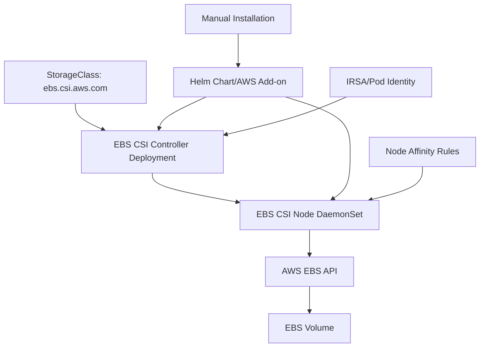
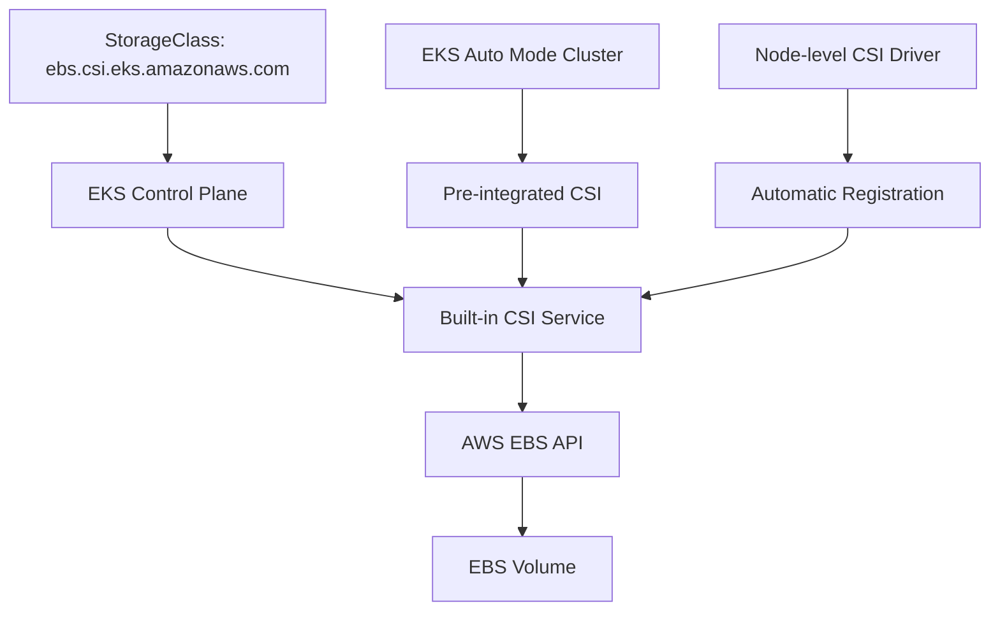

# EBS CSI Provisioner Comparison: Traditional vs EKS Auto Mode

## Overview

This document explains the fundamental differences between the two EBS CSI provisioners in Amazon EKS and why they represent completely different architectural approaches to storage management.

## Executive Summary

| Provisioner | Architecture | Use Case | Complexity |
|-------------|--------------|----------|------------|
| `ebs.csi.aws.com` | External CSI Driver | Traditional EKS | High |
| `ebs.csi.eks.amazonaws.com` | Built-in EKS Service | EKS Auto Mode | Low |

**Key Insight**: These are **not different versions** of the same driver - they are **completely different systems** with different architectures, capabilities, and operational models.

---

## Traditional EBS CSI Driver (`ebs.csi.aws.com`)

### Architecture



### Components Required

#### **1. Controller Deployment**
```yaml
# Runs in kube-system namespace
apiVersion: apps/v1
kind: Deployment
metadata:
  name: ebs-csi-controller
  namespace: kube-system
spec:
  replicas: 2
  selector:
    matchLabels:
      app: ebs-csi-controller
```

#### **2. Node DaemonSet**
```yaml
# Runs on every worker node
apiVersion: apps/v1
kind: DaemonSet
metadata:
  name: ebs-csi-node
  namespace: kube-system
spec:
  selector:
    matchLabels:
      app: ebs-csi-node
```

#### **3. Authentication Setup**
```yaml
# IRSA or Pod Identity required
apiVersion: v1
kind: ServiceAccount
metadata:
  name: ebs-csi-controller-sa
  annotations:
    eks.amazonaws.com/role-arn: arn:aws:iam::ACCOUNT:role/AmazonEKS_EBS_CSI_DriverRole
```

### Installation Methods

#### **Method 1: AWS EKS Add-on**
```bash
aws eks create-addon \
  --cluster-name my-cluster \
  --addon-name aws-ebs-csi-driver \
  --addon-version v1.25.0-eksbuild.1
```

#### **Method 2: Helm Chart**
```bash
helm repo add aws-ebs-csi-driver https://kubernetes-sigs.github.io/aws-ebs-csi-driver
helm install aws-ebs-csi-driver aws-ebs-csi-driver/aws-ebs-csi-driver \
  --namespace kube-system
```

### Node Compatibility

#### **Default Node Affinity (Problematic for Auto Mode)**
```yaml
# This excludes Auto Mode nodes!
nodeAffinity:
  requiredDuringSchedulingIgnoredDuringExecution:
    nodeSelectorTerms:
    - matchExpressions:
      - key: eks.amazonaws.com/compute-type
        operator: NotIn
        values: ["fargate", "auto"]  # Excludes Auto Mode!
```

#### **Compatible Node Types**
- ✅ **Managed Node Groups** (`compute-type=ec2`)
- ✅ **Self-managed nodes** (`compute-type=ec2`)
- ❌ **Fargate nodes** (`compute-type=fargate`)
- ❌ **Auto Mode nodes** (`compute-type=auto`) - **Requires manual fix**

### Storage Class Configuration

```yaml
apiVersion: storage.k8s.io/v1
kind: StorageClass
metadata:
  name: ebs-traditional
provisioner: ebs.csi.aws.com  # Traditional provisioner
volumeBindingMode: WaitForFirstConsumer
parameters:
  type: gp3
  fsType: ext4
```

### Operational Overhead

#### **Management Tasks**
- 🔧 **Installation** - Manual setup required
- 🔧 **Updates** - Manual version management
- 🔧 **Authentication** - IRSA/Pod Identity setup
- 🔧 **Node Affinity** - Manual configuration for Auto Mode
- 🔧 **Troubleshooting** - Pod logs, daemonset issues
- 🔧 **Scaling** - Controller replica management

#### **Common Issues**
- **NodeAffinity conflicts** with Auto Mode
- **Pod Identity vs IRSA** authentication problems
- **Daemonset scheduling** failures
- **Version compatibility** issues
- **Resource consumption** by CSI pods

---

## EKS Auto Mode EBS CSI (`ebs.csi.eks.amazonaws.com`)

### Architecture



### Components Required

#### **Zero External Components**
```bash
# No pods required!
kubectl get pods -n kube-system | grep ebs
# Result: No resources found

# No daemonsets required!
kubectl get daemonset -n kube-system | grep ebs
# Result: No resources found

# No deployments required!
kubectl get deployment -n kube-system | grep ebs
# Result: No resources found
```

#### **Built-in CSI Driver Registration**
```yaml
# Automatically available
apiVersion: storage.k8s.io/v1
kind: CSIDriver
metadata:
  name: ebs.csi.eks.amazonaws.com
spec:
  attachRequired: true
  podInfoOnMount: false
  volumeLifecycleModes:
  - Persistent
```

#### **Node-level Integration**
```yaml
# Automatic on every Auto Mode node
apiVersion: storage.k8s.io/v1
kind: CSINode
metadata:
  name: i-07ef2bb528e77a737
spec:
  drivers:
  - name: ebs.csi.eks.amazonaws.com
    nodeID: i-07ef2bb528e77a737
    topologyKeys:
    - eks.amazonaws.com/compute-type
    - topology.ebs.csi.eks.amazonaws.com/zone
    - topology.kubernetes.io/zone
```

### Installation Methods

#### **Method 1: Automatic (Recommended)**
```bash
# Nothing to install - it's built-in!
# Just create an Auto Mode cluster and it's available
```

#### **Method 2: Verify Availability**
```bash
# Check if CSI driver is available
kubectl get csidriver ebs.csi.eks.amazonaws.com
```

### Node Compatibility

#### **Native Auto Mode Support**
```yaml
# Built-in node affinity (Auto Mode optimized)
nodeAffinity:
  required:
    nodeSelectorTerms:
    - matchExpressions:
      - key: eks.amazonaws.com/compute-type
        operator: In
        values: ["auto"]  # REQUIRES Auto Mode nodes!
```

#### **Compatible Node Types**
- ❌ **Managed Node Groups** (`compute-type=ec2`)
- ❌ **Self-managed nodes** (`compute-type=ec2`)
- ❌ **Fargate nodes** (`compute-type=fargate`)
- ✅ **Auto Mode nodes** (`compute-type=auto`) - **Native support**

### Storage Class Configuration

```yaml
apiVersion: storage.k8s.io/v1
kind: StorageClass
metadata:
  name: ebs-auto-mode
provisioner: ebs.csi.eks.amazonaws.com  # Auto Mode provisioner
volumeBindingMode: WaitForFirstConsumer
parameters:
  type: gp3
  fsType: ext4
```

### Operational Overhead

#### **Management Tasks**
- ✅ **Installation** - None required (built-in)
- ✅ **Updates** - Automatic with EKS updates
- ✅ **Authentication** - Automatic with Auto Mode
- ✅ **Node Affinity** - Native Auto Mode support
- ✅ **Troubleshooting** - EKS service reliability
- ✅ **Scaling** - Managed by AWS

#### **Zero Operational Issues**
- ✅ **No NodeAffinity conflicts**
- ✅ **No authentication setup needed**
- ✅ **No daemonset management**
- ✅ **No version management**
- ✅ **No resource consumption by CSI pods**

---

## Detailed Comparison

### Architecture Differences

| Aspect | Traditional (`ebs.csi.aws.com`) | Auto Mode (`ebs.csi.eks.amazonaws.com`) |
|--------|--------------------------------|----------------------------------------|
| **Deployment Model** | External pods in cluster | Built into EKS control plane |
| **Installation** | Manual (Add-on/Helm) | Automatic with Auto Mode |
| **Components** | Controller + DaemonSet | Zero external components |
| **Authentication** | IRSA/Pod Identity setup | Built-in with Auto Mode |
| **Node Requirements** | Traditional nodes only | Auto Mode nodes only |
| **Updates** | Manual version management | Automatic with EKS |
| **Resource Usage** | Pods consume cluster resources | Zero cluster resource usage |
| **Troubleshooting** | Pod logs, K8s debugging | AWS service reliability |

### Compatibility Matrix

| Cluster Type | Traditional Provisioner | Auto Mode Provisioner | Recommendation |
|--------------|------------------------|----------------------|----------------|
| **Traditional EKS** | ✅ Native | ❌ Not available | Use `ebs.csi.aws.com` |
| **EKS Auto Mode** | ⚠️ Requires fixes | ✅ Native | Use `ebs.csi.eks.amazonaws.com` |
| **Hybrid (Mixed)** | ⚠️ Conflicts | ⚠️ Conflicts | Avoid - use separate clusters |

### Performance Comparison

| Metric | Traditional | Auto Mode | Winner |
|--------|-------------|-----------|---------|
| **Provisioning Speed** | Moderate | Fast | Auto Mode |
| **Resource Overhead** | High (pods) | Zero | Auto Mode |
| **Reliability** | Pod-dependent | AWS SLA | Auto Mode |
| **Scalability** | Limited by pods | AWS-managed | Auto Mode |
| **Troubleshooting** | Complex | Simple | Auto Mode |

---

## Migration Scenarios

### Scenario 1: Traditional EKS → Auto Mode

#### **Before (Traditional)**
```yaml
apiVersion: storage.k8s.io/v1
kind: StorageClass
metadata:
  name: ebs-storage
provisioner: ebs.csi.aws.com
parameters:
  type: gp3
```

#### **After (Auto Mode)**
```yaml
apiVersion: storage.k8s.io/v1
kind: StorageClass
metadata:
  name: ebs-storage
provisioner: ebs.csi.eks.amazonaws.com  # Only change needed!
parameters:
  type: gp3
```

#### **Migration Steps**
1. **Create Auto Mode cluster**
2. **Update StorageClass provisioner**
3. **Redeploy applications**
4. **Remove traditional EBS CSI add-on**

### Scenario 2: Hybrid Cluster (Not Recommended)

#### **Problems with Mixed Provisioners**
```yaml
# This causes conflicts!
---
apiVersion: storage.k8s.io/v1
kind: StorageClass
metadata:
  name: traditional-storage
provisioner: ebs.csi.aws.com  # For managed node groups

---
apiVersion: storage.k8s.io/v1
kind: StorageClass
metadata:
  name: auto-mode-storage
provisioner: ebs.csi.eks.amazonaws.com  # For Auto Mode nodes
```

#### **Issues**
- **Node scheduling conflicts**
- **Authentication complexity**
- **Operational overhead**
- **Debugging difficulties**

---

## Real-World Examples

### Example 1: Jenkins Deployment

#### **Traditional EKS Approach**
```bash
# 1. Install EBS CSI driver
aws eks create-addon --cluster-name my-cluster --addon-name aws-ebs-csi-driver

# 2. Fix node affinity for Auto Mode (if needed)
kubectl patch daemonset ebs-csi-node -n kube-system --patch='...'

# 3. Create StorageClass
kubectl apply -f - <<EOF
apiVersion: storage.k8s.io/v1
kind: StorageClass
metadata:
  name: jenkins-storage
provisioner: ebs.csi.aws.com
volumeBindingMode: WaitForFirstConsumer
parameters:
  type: gp3
EOF

# 4. Deploy Jenkins
helm install jenkins jenkinsci/jenkins -f values.yaml
```

#### **Auto Mode Approach**
```bash
# 1. No CSI driver installation needed!

# 2. Create StorageClass
kubectl apply -f - <<EOF
apiVersion: storage.k8s.io/v1
kind: StorageClass
metadata:
  name: jenkins-storage
provisioner: ebs.csi.eks.amazonaws.com  # Auto Mode provisioner
volumeBindingMode: WaitForFirstConsumer
parameters:
  type: gp3
EOF

# 3. Deploy Jenkins
helm install jenkins jenkinsci/jenkins -f values.yaml
```

### Example 2: Troubleshooting Storage Issues

#### **Traditional EKS Debugging**
```bash
# Check CSI controller pods
kubectl get pods -n kube-system -l app=ebs-csi-controller

# Check CSI node daemonset
kubectl get pods -n kube-system -l app=ebs-csi-node

# Check controller logs
kubectl logs -n kube-system deployment/ebs-csi-controller

# Check node logs
kubectl logs -n kube-system daemonset/ebs-csi-node

# Check IRSA/Pod Identity
kubectl describe serviceaccount ebs-csi-controller-sa -n kube-system

# Check node affinity issues
kubectl describe daemonset ebs-csi-node -n kube-system
```

#### **Auto Mode Debugging**
```bash
# Check CSI driver availability
kubectl get csidriver ebs.csi.eks.amazonaws.com

# Check node CSI registration
kubectl get csinode

# Check PVC events
kubectl describe pvc my-pvc

# That's it! No pods to debug.
```

---

## Best Practices

### For Traditional EKS

#### **✅ Do**
- Use `ebs.csi.aws.com` provisioner
- Install via AWS EKS Add-on for better support
- Set up proper IRSA authentication
- Monitor CSI pod health
- Plan for version updates

#### **❌ Don't**
- Mix with Auto Mode nodes without fixes
- Ignore node affinity requirements
- Skip authentication setup
- Forget to update versions

### For EKS Auto Mode

#### **✅ Do**
- Use `ebs.csi.eks.amazonaws.com` provisioner
- Rely on built-in integration
- Use `WaitForFirstConsumer` binding mode
- Leverage Karpenter's topology awareness

#### **❌ Don't**
- Try to install traditional EBS CSI driver
- Mix provisioners in the same cluster
- Override built-in configurations
- Expect traditional CSI pods to work

### General Guidelines

#### **Cluster Strategy**
- **Pure Traditional**: Use `ebs.csi.aws.com` only
- **Pure Auto Mode**: Use `ebs.csi.eks.amazonaws.com` only
- **Avoid Hybrid**: Don't mix provisioners

#### **Migration Planning**
- **Test thoroughly** in staging
- **Update all StorageClasses** during migration
- **Plan for application redeployment**
- **Remove old CSI components** after migration

---

## Troubleshooting Guide

### Common Issues with Traditional EBS CSI

#### **Issue 1: NodeAffinity Excludes Auto Mode Nodes**
```bash
# Symptom
kubectl get pods -n kube-system -l app=ebs-csi-node
# No pods on Auto Mode nodes

# Solution
kubectl patch daemonset ebs-csi-node -n kube-system --patch='
spec:
  template:
    spec:
      affinity:
        nodeAffinity:
          requiredDuringSchedulingIgnoredDuringExecution:
            nodeSelectorTerms:
            - matchExpressions:
              - key: eks.amazonaws.com/compute-type
                operator: NotIn
                values: ["fargate"]  # Remove "auto" from exclusion
'
```

#### **Issue 2: Authentication Problems**
```bash
# Symptom
kubectl logs -n kube-system deployment/ebs-csi-controller
# Error: unable to load credentials

# Solution: Check IRSA setup
kubectl describe serviceaccount ebs-csi-controller-sa -n kube-system
```

### Common Issues with Auto Mode EBS CSI

#### **Issue 1: Wrong Provisioner Used**
```bash
# Symptom
kubectl describe pvc my-pvc
# Error: provisioner is not supported

# Solution: Update StorageClass
kubectl patch storageclass my-storage-class -p '{"provisioner":"ebs.csi.eks.amazonaws.com"}'
```

#### **Issue 2: Traditional Nodes in Auto Mode Cluster**
```bash
# Symptom
kubectl get nodes -l eks.amazonaws.com/compute-type!=auto
# Shows non-Auto Mode nodes

# Solution: Use pure Auto Mode cluster or separate provisioners
```

---

## Conclusion

The choice between `ebs.csi.aws.com` and `ebs.csi.eks.amazonaws.com` is not just about different provisioner names - it represents a **fundamental architectural decision**:

### **Traditional EBS CSI (`ebs.csi.aws.com`)**
- **Best for**: Existing EKS clusters, managed node groups, complex custom configurations
- **Characteristics**: Full control, operational overhead, manual management
- **Use when**: You need maximum flexibility and control

### **Auto Mode EBS CSI (`ebs.csi.eks.amazonaws.com`)**
- **Best for**: New cloud-native applications, auto-scaling workloads, operational simplicity
- **Characteristics**: Zero overhead, AWS-managed, built-in reliability
- **Use when**: You want operational simplicity and cloud-native architecture

### **Key Recommendation**
**Choose your cluster architecture first, then use the matching provisioner.** Don't try to force traditional patterns onto Auto Mode or vice versa.

The future of EKS storage is clearly moving toward the **Auto Mode model** - built-in, managed, and operationally simple. Traditional approaches remain valid for existing workloads but new deployments should strongly consider the Auto Mode approach for its operational benefits.

---

## References

- [Amazon EKS Auto Mode Documentation](https://docs.aws.amazon.com/eks/latest/userguide/auto-mode.html)
- [EBS CSI Driver Documentation](https://docs.aws.amazon.com/eks/latest/userguide/ebs-csi.html)
- [Karpenter Documentation](https://karpenter.sh/)
- [CSI Driver Specification](https://kubernetes-csi.github.io/docs/)

---

*This document is based on real-world testing and analysis of both provisioner types in production EKS environments.*
