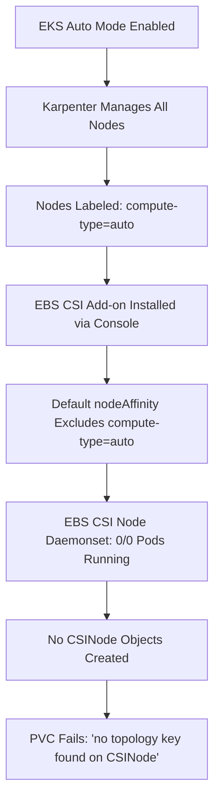

# EKS Auto Mode + EBS CSI Driver Compatibility Issue

## Problem Overview

When using **EKS Auto Mode** with the **EBS CSI Driver** installed via AWS Console, Persistent Volume Claims (PVCs) fail to provision with topology-related errors. This is due to a configuration incompatibility between Karpenter-managed nodes and the default EBS CSI driver settings.

## Root Cause Analysis

### The Issue Chain



### Technical Details

#### What EKS Auto Mode Does
- Uses **Karpenter** for automatic node provisioning
- Labels ALL nodes with `eks.amazonaws.com/compute-type=auto`
- Provides fully functional EC2 instances with EBS support

#### What EBS CSI Driver Does (Default Config)
- Excludes nodes with `compute-type=auto` via nodeAffinity
- Prevents EBS CSI node daemonset from scheduling
- Results in missing topology information for volume provisioning

#### The Problematic Configuration
```yaml
# Found in EBS CSI node daemonset
nodeAffinity:
  requiredDuringSchedulingIgnoredDuringExecution:
    nodeSelectorTerms:
    - matchExpressions:
      - key: eks.amazonaws.com/compute-type
        operator: NotIn
        values:
        - fargate    # ✅ Correct - Fargate can't run EBS CSI
        - auto       # ❌ Problem - Excludes ALL Karpenter nodes
        - hybrid     # ✅ Correct - For edge computing scenarios
```

## Symptoms

### 1. PVC Stuck in Pending State
```bash
$ kubectl get pvc
NAME      STATUS    VOLUME   CAPACITY   ACCESS MODES   STORAGECLASS
jenkins   Pending                                      gp2-csi
```

### 2. Topology Error Messages
```bash
$ kubectl describe pvc jenkins
Events:
  Warning  ProvisioningFailed  failed to provision volume with StorageClass "gp2-csi": 
           error generating accessibility requirements: no topology key found on CSINode i-099fd9374a3b3b3f7
```

### 3. EBS CSI Node Pods Not Running
```bash
$ kubectl get pods -n kube-system -l app=ebs-csi-node
No resources found in kube-system namespace.

$ kubectl get daemonset ebs-csi-node -n kube-system
NAME           DESIRED   CURRENT   READY   UP-TO-DATE   AVAILABLE   NODE SELECTOR
ebs-csi-node   0         0         0       0            0           kubernetes.io/os=linux
```

## Diagnostic Steps

### 1. Verify You Have EKS Auto Mode
```bash
# Check if nodes are managed by Karpenter
kubectl get nodes -o custom-columns=NAME:.metadata.name,COMPUTE-TYPE:.metadata.labels.eks\.amazonaws\.com/compute-type,NODEPOOL:.metadata.labels.karpenter\.sh/nodepool

# Expected output for Auto Mode:
# NAME                  COMPUTE-TYPE   NODEPOOL
# i-0123456789abcdef0   auto           general-purpose
# i-0987654321fedcba0   auto           system
```

### 2. Check EBS CSI Node Daemonset Status
```bash
# Should show 0 desired/ready if affected
kubectl get daemonset ebs-csi-node -n kube-system

# Check the nodeAffinity configuration
kubectl get daemonset ebs-csi-node -n kube-system -o yaml | grep -A 15 nodeAffinity
```

### 3. Verify Missing CSINode Objects
```bash
# Should show missing CSINode for some nodes
kubectl get nodes
kubectl get csinode

# Compare the lists - missing CSINodes indicate the problem
```

## Solutions

### Solution 1: Patch Existing Daemonset (Quick Fix)

#### Step 1: Remove Problematic nodeAffinity Rule
```bash
kubectl patch daemonset ebs-csi-node -n kube-system --type='json' \
  -p='[{"op": "remove", "path": "/spec/template/spec/affinity/nodeAffinity/requiredDuringSchedulingIgnoredDuringExecution/nodeSelectorTerms/0/matchExpressions/0"}]'
```

#### Step 2: Verify Fix Applied
```bash
# Should now show pods running on all nodes
kubectl get pods -n kube-system -l app=ebs-csi-node

# Should show CSINode objects for all nodes
kubectl get csinode
```

#### Step 3: Test PVC Provisioning
```bash
# Create test PVC
kubectl apply -f - <<EOF
apiVersion: v1
kind: PersistentVolumeClaim
metadata:
  name: test-pvc
  namespace: default
spec:
  accessModes:
    - ReadWriteOnce
  resources:
    requests:
      storage: 1Gi
  storageClassName: gp2-csi
EOF

# Should transition to Bound status
kubectl get pvc test-pvc
```

### Solution 2: Reinstall EBS CSI with Correct Configuration (Permanent Fix)

#### Step 1: Remove Existing EBS CSI Add-on
```bash
# Via AWS CLI
aws eks delete-addon --cluster-name <your-cluster-name> --addon-name aws-ebs-csi-driver

# Or via AWS Console: EKS → Cluster → Add-ons → Delete aws-ebs-csi-driver
```

#### Step 2: Install with Custom Configuration

**Option A: AWS CLI**
```bash
# Create configuration file
cat > ebs-csi-config.json <<EOF
{
  "node": {
    "nodeAffinity": {
      "requiredDuringSchedulingIgnoredDuringExecution": {
        "nodeSelectorTerms": [{
          "matchExpressions": [{
            "key": "eks.amazonaws.com/compute-type",
            "operator": "NotIn",
            "values": ["fargate"]
          }]
        }]
      }
    }
  }
}
EOF

# Install with custom config
aws eks create-addon \
  --cluster-name <your-cluster-name> \
  --addon-name aws-ebs-csi-driver \
  --configuration-values file://ebs-csi-config.json
```

**Option B: Terraform**
```hcl
resource "aws_eks_addon" "ebs_csi" {
  cluster_name = aws_eks_cluster.main.name
  addon_name   = "aws-ebs-csi-driver"
  
  configuration_values = jsonencode({
    node = {
      nodeAffinity = {
        requiredDuringSchedulingIgnoredDuringExecution = {
          nodeSelectorTerms = [{
            matchExpressions = [{
              key      = "eks.amazonaws.com/compute-type"
              operator = "NotIn"
              values   = ["fargate"]
            }]
          }]
        }
      }
    }
  })
}
```

**Option C: CloudFormation**
```yaml
EBSCSIAddon:
  Type: AWS::EKS::Addon
  Properties:
    ClusterName: !Ref EKSCluster
    AddonName: aws-ebs-csi-driver
    ConfigurationValues: |
      {
        "node": {
          "nodeAffinity": {
            "requiredDuringSchedulingIgnoredDuringExecution": {
              "nodeSelectorTerms": [{
                "matchExpressions": [{
                  "key": "eks.amazonaws.com/compute-type",
                  "operator": "NotIn",
                  "values": ["fargate"]
                }]
              }]
            }
          }
        }
      }
```

### Solution 3: Deploy Traditional Managed Node Groups (Alternative Approach)

Instead of modifying the EBS CSI driver, you can deploy traditional managed node groups alongside or instead of Karpenter nodes. These nodes won't have the `compute-type=auto` label and will be compatible with the default EBS CSI configuration.

#### Option A: Mixed Deployment (Karpenter + Managed Node Groups)

**Step 1: Create a Managed Node Group**
```bash
# Via AWS CLI
aws eks create-nodegroup \
  --cluster-name <your-cluster-name> \
  --nodegroup-name ebs-compatible-nodes \
  --instance-types c5.large \
  --ami-type AL2_x86_64 \
  --capacity-type ON_DEMAND \
  --scaling-config minSize=1,maxSize=3,desiredSize=2 \
  --subnets subnet-12345678 subnet-87654321 \
  --node-role arn:aws:iam::123456789012:role/NodeInstanceRole
```

**Step 2: Taint Managed Nodes for EBS CSI Only**
```bash
# Taint managed nodes so only EBS CSI pods schedule there
kubectl taint nodes -l eks.amazonaws.com/compute-type!=auto \
  ebs-csi-only=true:NoSchedule
```

**Step 3: Update EBS CSI to Prefer Managed Nodes**
```bash
# Patch EBS CSI to tolerate the taint and prefer managed nodes
kubectl patch daemonset ebs-csi-node -n kube-system --type='json' -p='[
  {
    "op": "add",
    "path": "/spec/template/spec/tolerations/-",
    "value": {
      "key": "ebs-csi-only",
      "operator": "Equal",
      "value": "true",
      "effect": "NoSchedule"
    }
  },
  {
    "op": "add",
    "path": "/spec/template/spec/affinity/nodeAffinity/preferredDuringSchedulingIgnoredDuringExecution",
    "value": [{
      "weight": 100,
      "preference": {
        "matchExpressions": [{
          "key": "eks.amazonaws.com/compute-type",
          "operator": "NotIn",
          "values": ["auto"]
        }]
      }
    }]
  }
]'
```

#### Option B: Replace Karpenter with Managed Node Groups

**Terraform Example:**
```hcl
# Disable Auto Mode and use traditional managed node groups
resource "aws_eks_node_group" "main" {
  cluster_name    = aws_eks_cluster.main.name
  node_group_name = "main-nodes"
  node_role_arn   = aws_iam_role.node_group.arn
  subnet_ids      = var.private_subnet_ids

  instance_types = ["c5.large", "c5.xlarge"]
  capacity_type  = "ON_DEMAND"

  scaling_config {
    desired_size = 2
    max_size     = 10
    min_size     = 1
  }

  # These nodes will have compute-type=ec2, not auto
  labels = {
    "node-type" = "managed"
  }
}

# EBS CSI will work with default configuration
resource "aws_eks_addon" "ebs_csi" {
  cluster_name = aws_eks_cluster.main.name
  addon_name   = "aws-ebs-csi-driver"
  # No custom configuration needed
}
```

**CloudFormation Example:**
```yaml
ManagedNodeGroup:
  Type: AWS::EKS::Nodegroup
  Properties:
    ClusterName: !Ref EKSCluster
    NodegroupName: main-nodes
    NodeRole: !GetAtt NodeInstanceRole.Arn
    Subnets: !Ref PrivateSubnets
    InstanceTypes:
      - c5.large
      - c5.xlarge
    CapacityType: ON_DEMAND
    ScalingConfig:
      DesiredSize: 2
      MaxSize: 10
      MinSize: 1
    Labels:
      node-type: managed

EBSCSIAddon:
  Type: AWS::EKS::Addon
  Properties:
    ClusterName: !Ref EKSCluster
    AddonName: aws-ebs-csi-driver
    # Default configuration works with managed node groups
  DependsOn: ManagedNodeGroup
```

#### Pros and Cons of This Approach

**Pros:**
- ✅ **No EBS CSI modification** required
- ✅ **Uses AWS default configurations**
- ✅ **Guaranteed compatibility** with all add-ons
- ✅ **Familiar operational model** for traditional EKS users

**Cons:**
- ❌ **Loses Karpenter benefits** (auto-scaling, cost optimization)
- ❌ **Manual node management** required
- ❌ **Less efficient** resource utilization
- ❌ **Higher operational overhead**
- ❌ **Mixed complexity** if using both approaches

#### When to Use This Approach

**Good for:**
- **Temporary workaround** while waiting for AWS to fix defaults
- **Organizations with strict change control** that can't modify add-ons
- **Hybrid deployments** where some workloads need guaranteed node availability
- **Compliance requirements** that mandate traditional node groups

**Not recommended for:**
- **New EKS Auto Mode deployments** (fix the CSI driver instead)
- **Cost-sensitive environments** (Karpenter is more efficient)
- **Dynamic workloads** (Karpenter handles scaling better)

## Prevention Strategies

### 1. Use Infrastructure as Code
- **Always use Terraform/CloudFormation** for EKS add-ons
- **Avoid AWS Console** for add-on installation in Auto Mode clusters
- **Version control** your add-on configurations

### 2. Post-Installation Validation
```bash
#!/bin/bash
# Add to your deployment pipeline

echo "Validating EBS CSI deployment..."

# Check daemonset status
DESIRED=$(kubectl get daemonset ebs-csi-node -n kube-system -o jsonpath='{.status.desiredNumberScheduled}')
READY=$(kubectl get daemonset ebs-csi-node -n kube-system -o jsonpath='{.status.numberReady}')

if [ "$DESIRED" -eq 0 ] || [ "$READY" -ne "$DESIRED" ]; then
    echo "❌ EBS CSI node daemonset not properly deployed"
    echo "Desired: $DESIRED, Ready: $READY"
    exit 1
fi

# Check CSINode objects
NODE_COUNT=$(kubectl get nodes --no-headers | wc -l)
CSINODE_COUNT=$(kubectl get csinode --no-headers | wc -l)

if [ "$NODE_COUNT" -ne "$CSINODE_COUNT" ]; then
    echo "❌ Missing CSINode objects"
    echo "Nodes: $NODE_COUNT, CSINodes: $CSINODE_COUNT"
    exit 1
fi

echo "✅ EBS CSI deployment validated successfully"
```

### 3. Monitoring and Alerting
```yaml
# CloudWatch/Prometheus alert
alert: EBSCSINodeDaemonsetDown
expr: kube_daemonset_status_number_ready{daemonset="ebs-csi-node"} == 0
for: 5m
labels:
  severity: critical
annotations:
  summary: "EBS CSI node daemonset has no ready pods"
  description: "The EBS CSI node daemonset in namespace kube-system has 0 ready pods, which will prevent PVC provisioning."
```

## Why This Happens

### Historical Context
The EBS CSI driver's nodeAffinity was designed before EKS Auto Mode existed:

- **Original intent**: Exclude experimental/unsupported compute types
- **`fargate`**: Correct exclusion (no local storage support)
- **`auto`**: Originally meant "experimental," now means "Karpenter-managed"
- **`hybrid`**: Correct exclusion (edge computing scenarios)

### AWS's Oversight
- **EKS Auto Mode** (late 2024) uses `compute-type=auto` for standard nodes
- **EBS CSI defaults** weren't updated for Auto Mode compatibility
- **Different AWS teams** with different release cycles
- **Backward compatibility** concerns prevent changing defaults

## Impact on Other Add-ons

This issue potentially affects other AWS add-ons that have similar nodeAffinity rules:

```bash
# Check other add-ons for similar issues
kubectl get daemonset -A -o yaml | grep -B5 -A5 "compute-type"
```

Common affected add-ons:
- **EFS CSI Driver**
- **FSx CSI Driver**
- **VPC CNI** (less common, usually more tolerant)

## Verification Commands

### Before Fix
```bash
# These should show the problem
kubectl get pods -n kube-system -l app=ebs-csi-node                    # No pods
kubectl get daemonset ebs-csi-node -n kube-system                      # 0 desired
kubectl describe pvc <your-pvc>                                        # Topology errors
```

### After Fix
```bash
# These should show the solution working
kubectl get pods -n kube-system -l app=ebs-csi-node                    # Pods running
kubectl get csinode                                                     # CSINodes present
kubectl get pvc                                                         # PVCs bound
```

## Troubleshooting

### Issue: Patch Command Fails
```bash
# Error: path not found
# Solution: Check the exact path in your daemonset
kubectl get daemonset ebs-csi-node -n kube-system -o yaml | grep -A 20 nodeAffinity
```

### Issue: Still No Pods After Patch
```bash
# Check for other scheduling constraints
kubectl describe daemonset ebs-csi-node -n kube-system
kubectl get nodes --show-labels | grep compute-type
```

### Issue: PVCs Still Pending After Fix
```bash
# Wait for CSINode objects to be created
kubectl get csinode
# Restart any stuck provisioning attempts
kubectl delete pod <pending-pod>
```

## Conclusion

This is a **known compatibility issue** between EKS Auto Mode and the default EBS CSI driver configuration. The fix is straightforward but requires understanding the root cause. 

**Key Takeaways:**
1. **Always validate add-on deployments** in Auto Mode clusters
2. **Use Infrastructure as Code** to avoid default configuration issues
3. **This will likely be fixed by AWS** in future EBS CSI driver versions
4. **The fix is safe** - Karpenter nodes fully support EBS CSI functionality

**Recommendation:** Apply the patch immediately for existing clusters, and use custom configuration for new deployments to avoid this issue entirely.
