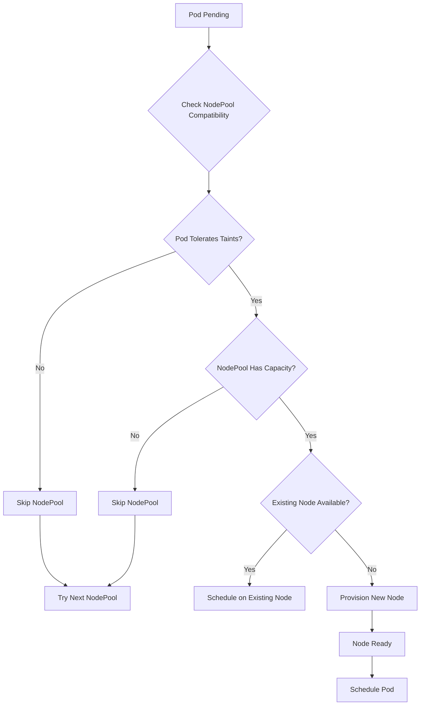

# EKS Auto Mode: Node Pool Management Guide

## Overview

EKS Auto Mode leverages **Karpenter** to provide fully managed node provisioning and scaling. This guide covers how EKS Auto Mode manages node pools by default and what you need to know as an EKS administrator.

## Table of Contents

1. [Default Node Pool Configuration](#default-node-pool-configuration)
2. [Node Pool Management Principles](#node-pool-management-principles)
3. [Administrative Tasks](#administrative-tasks)
4. [Monitoring and Troubleshooting](#monitoring-and-troubleshooting)
5. [Best Practices](#best-practices)
6. [Common Issues and Solutions](#common-issues-and-solutions)

---

## Default Node Pool Configuration

EKS Auto Mode creates **two default NodePools** automatically:

### 1. `general-purpose` NodePool

```yaml
apiVersion: karpenter.sh/v1
kind: NodePool
metadata:
  name: general-purpose
  labels:
    app.kubernetes.io/managed-by: eks
spec:
  disruption:
    consolidationPolicy: WhenEmptyOrUnderutilized
    consolidateAfter: 30s
    budgets:
      - nodes: "10%"
  template:
    spec:
      expireAfter: 336h  # 14 days
      nodeClassRef:
        kind: NodeClass
        name: default
      requirements:
        - key: karpenter.sh/capacity-type
          operator: In
          values: ["on-demand"]
        - key: eks.amazonaws.com/instance-category
          operator: In
          values: ["c", "m", "r"]
        - key: eks.amazonaws.com/instance-generation
          operator: Gt
          values: ["4"]
        - key: kubernetes.io/arch
          operator: In
          values: ["amd64"]
        - key: kubernetes.io/os
          operator: In
          values: ["linux"]
      terminationGracePeriod: 24h
```

**Purpose**: Regular application workloads
**Instance Types**: C5+, M5+, R5+ families
**Architecture**: AMD64 only
**Capacity**: On-demand instances only
**Taints**: None (accepts all pods)

### 2. `system` NodePool

```yaml
apiVersion: karpenter.sh/v1
kind: NodePool
metadata:
  name: system
  labels:
    app.kubernetes.io/managed-by: eks
spec:
  disruption:
    consolidationPolicy: WhenEmptyOrUnderutilized
    consolidateAfter: 30s
    budgets:
      - nodes: "10%"
  template:
    spec:
      expireAfter: 336h  # 14 days
      nodeClassRef:
        kind: NodeClass
        name: default
      requirements:
        - key: karpenter.sh/capacity-type
          operator: In
          values: ["on-demand"]
        - key: eks.amazonaws.com/instance-category
          operator: In
          values: ["c", "m", "r"]
        - key: eks.amazonaws.com/instance-generation
          operator: Gt
          values: ["4"]
        - key: kubernetes.io/arch
          operator: In
          values: ["amd64", "arm64"]
        - key: kubernetes.io/os
          operator: In
          values: ["linux"]
      taints:
        - key: CriticalAddonsOnly
          effect: NoSchedule
      terminationGracePeriod: 24h
```

**Purpose**: System and infrastructure workloads
**Instance Types**: C5+, M5+, R5+ families
**Architecture**: AMD64 and ARM64
**Capacity**: On-demand instances only
**Taints**: `CriticalAddonsOnly:NoSchedule`

---

## Node Pool Management Principles

### Automatic Provisioning

Karpenter follows these principles:

1. **Pod-Driven**: Nodes are provisioned only when pods are pending
2. **Just-in-Time**: Minimal delay between pod scheduling and node availability
3. **Bin Packing**: Multiple compatible pods are placed on the same node
4. **Cost Optimization**: Cheapest instance type that meets requirements

### Node Selection Logic

When a pod needs scheduling:



### Disruption Management

Karpenter automatically handles:

- **Consolidation**: Moves pods to fewer nodes when possible
- **Expiration**: Replaces nodes after 14 days (configurable)
- **Drift**: Updates nodes when NodePool configuration changes
- **Interruption**: Handles spot instance interruptions gracefully

---

## Administrative Tasks

### 1. Monitoring Node Pools

#### View Current Node Pools
```bash
kubectl get nodepool
```

#### Detailed Node Pool Information
```bash
kubectl describe nodepool general-purpose
kubectl describe nodepool system
```

#### Check Node Pool Status
```bash
kubectl get nodepool -o wide
```

### 2. Viewing Node Information

#### List All Nodes with Labels
```bash
kubectl get nodes --show-labels
```

#### Check Node Pool Assignment
```bash
kubectl get nodes -o custom-columns=NAME:.metadata.name,NODEPOOL:.metadata.labels.karpenter\.sh/nodepool
```

#### Node Resource Utilization
```bash
kubectl top nodes
```

### 3. Pod Scheduling Analysis

#### Check Pod Node Affinity
```bash
kubectl get pods -o wide
```

#### View Pod Scheduling Events
```bash
kubectl describe pod <pod-name>
```

#### Check Pending Pods
```bash
kubectl get pods --field-selector=status.phase=Pending
```

### 4. Creating Custom Node Pools

#### Example: GPU Workload Node Pool
```yaml
apiVersion: karpenter.sh/v1
kind: NodePool
metadata:
  name: gpu-workloads
spec:
  disruption:
    consolidationPolicy: WhenEmpty
    consolidateAfter: 30s
  template:
    spec:
      expireAfter: 168h  # 7 days
      nodeClassRef:
        kind: NodeClass
        name: default
      requirements:
        - key: node.kubernetes.io/instance-type
          operator: In
          values: ["p3.2xlarge", "p3.8xlarge", "p4d.24xlarge"]
        - key: karpenter.sh/capacity-type
          operator: In
          values: ["spot", "on-demand"]
      taints:
        - key: nvidia.com/gpu
          value: "true"
          effect: NoSchedule
  limits:
    cpu: 1000
    memory: 1000Gi
```

#### Example: Spot Instance Node Pool
```yaml
apiVersion: karpenter.sh/v1
kind: NodePool
metadata:
  name: spot-workloads
spec:
  disruption:
    consolidationPolicy: WhenUnderutilized
    consolidateAfter: 15s
  template:
    spec:
      expireAfter: 72h  # 3 days
      nodeClassRef:
        kind: NodeClass
        name: default
      requirements:
        - key: karpenter.sh/capacity-type
          operator: In
          values: ["spot"]
        - key: eks.amazonaws.com/instance-category
          operator: In
          values: ["c", "m", "r"]
        - key: kubernetes.io/arch
          operator: In
          values: ["amd64"]
      taints:
        - key: spot-instance
          value: "true"
          effect: NoSchedule
  limits:
    cpu: 500
    memory: 500Gi
```

### 5. Modifying Default Node Pools

⚠️ **Warning**: Default node pools are managed by EKS. Modifications may be overwritten.

#### Safe Modifications (Persistent)
- Adding custom labels to nodes
- Creating additional node pools
- Configuring pod disruption budgets

#### Unsafe Modifications (May be Overwritten)
- Changing default node pool requirements
- Modifying default taints
- Changing disruption policies

---

## Monitoring and Troubleshooting

### Key Metrics to Monitor

#### Node Pool Health
```bash
# Check node pool conditions
kubectl get nodepool -o jsonpath='{range .items[*]}{.metadata.name}{"\t"}{.status.conditions[?(@.type=="Ready")].status}{"\n"}{end}'
```

#### Node Provisioning Events
```bash
# View Karpenter controller logs
kubectl logs -n karpenter -l app.kubernetes.io/name=karpenter
```

#### Resource Utilization
```bash
# Node resource usage
kubectl top nodes

# Pod resource requests vs limits
kubectl describe nodes | grep -A 5 "Allocated resources"
```

### Common Troubleshooting Commands

#### Debug Pending Pods
```bash
# Find pending pods
kubectl get pods --all-namespaces --field-selector=status.phase=Pending

# Check scheduling events
kubectl describe pod <pending-pod> -n <namespace>
```

#### Check Node Pool Compatibility
```bash
# Verify pod tolerations match node pool taints
kubectl get pod <pod-name> -o jsonpath='{.spec.tolerations}'
kubectl get nodepool <nodepool-name> -o jsonpath='{.spec.template.spec.taints}'
```

#### Validate Instance Requirements
```bash
# Check if instance types are available in your region/AZ
aws ec2 describe-instance-types --instance-types c5.large --region us-east-2
```

---

## Best Practices

### 1. Node Pool Design

#### Separate Workload Types
- **System workloads**: Use default `system` node pool
- **Application workloads**: Use default `general-purpose` node pool
- **Specialized workloads**: Create dedicated node pools (GPU, memory-intensive, etc.)

#### Resource Planning
```yaml
# Set appropriate limits to prevent runaway scaling
limits:
  cpu: 1000      # Total CPU across all nodes in pool
  memory: 1000Gi # Total memory across all nodes in pool
```

#### Instance Type Selection
```yaml
# Be specific about instance requirements
requirements:
  - key: node.kubernetes.io/instance-type
    operator: In
    values: ["c5.large", "c5.xlarge", "c5.2xlarge"]  # Specific types
  # OR
  - key: eks.amazonaws.com/instance-category
    operator: In
    values: ["c", "m"]  # Broader categories
```

### 2. Cost Optimization

#### Use Spot Instances for Fault-Tolerant Workloads
```yaml
requirements:
  - key: karpenter.sh/capacity-type
    operator: In
    values: ["spot", "on-demand"]  # Prefer spot, fallback to on-demand
```

#### Enable Consolidation
```yaml
disruption:
  consolidationPolicy: WhenUnderutilized
  consolidateAfter: 30s  # Aggressive consolidation
```

#### Set Appropriate Expiration
```yaml
spec:
  expireAfter: 168h  # 7 days for development, 720h (30 days) for production
```

### 3. Security and Compliance

#### Use Taints for Workload Isolation
```yaml
taints:
  - key: workload-type
    value: "sensitive"
    effect: NoSchedule
```

#### Apply Security Groups via NodeClass
```yaml
# Reference in NodePool
nodeClassRef:
  kind: NodeClass
  name: secure-nodeclass
```

### 4. Monitoring and Alerting

#### Set Up CloudWatch Alarms
- Node provisioning failures
- High node churn rate
- Cost anomalies

#### Monitor Key Metrics
- Node utilization rates
- Pod scheduling latency
- Failed node launches

---

## Common Issues and Solutions

### Issue 1: Pods Stuck in Pending State

**Symptoms**:
```bash
kubectl get pods --field-selector=status.phase=Pending
```

**Common Causes**:
1. **Insufficient resources**: Node pool limits exceeded
2. **Taint/toleration mismatch**: Pod can't tolerate node pool taints
3. **Instance type unavailable**: Requested instance types not available in AZ
4. **Service quotas**: AWS EC2 limits reached

**Solutions**:
```bash
# Check node pool limits
kubectl describe nodepool <nodepool-name>

# Verify pod tolerations
kubectl get pod <pod-name> -o jsonpath='{.spec.tolerations}'

# Check AWS service quotas
aws service-quotas get-service-quota --service-code ec2 --quota-code L-1216C47A
```

### Issue 2: High Node Churn

**Symptoms**: Nodes frequently created and terminated

**Common Causes**:
1. **Aggressive consolidation**: `consolidateAfter` too low
2. **Resource fragmentation**: Poor bin packing
3. **Short expiration**: `expireAfter` too short

**Solutions**:
```yaml
# Adjust consolidation settings
disruption:
  consolidationPolicy: WhenEmpty  # Less aggressive
  consolidateAfter: 300s          # 5 minutes instead of 30s

# Increase expiration time
spec:
  expireAfter: 720h  # 30 days
```

### Issue 3: Cost Overruns

**Symptoms**: Unexpected AWS bills

**Common Causes**:
1. **No resource limits**: Unlimited scaling
2. **On-demand only**: Not using spot instances
3. **Large instance types**: Over-provisioning

**Solutions**:
```yaml
# Set strict limits
limits:
  cpu: 100      # Limit total CPU
  memory: 100Gi # Limit total memory

# Enable spot instances
requirements:
  - key: karpenter.sh/capacity-type
    operator: In
    values: ["spot"]

# Restrict instance sizes
requirements:
  - key: node.kubernetes.io/instance-type
    operator: In
    values: ["t3.medium", "t3.large"]  # Smaller instances
```

### Issue 4: EBS CSI Driver Issues (Your Recent Experience)

**Symptoms**: PVCs stuck in Pending with topology errors

**Root Cause**: EBS CSI node daemonset not running due to nodeAffinity conflicts

**Solution**:
```bash
# Check if EBS CSI node pods are running
kubectl get pods -n kube-system -l app=ebs-csi-node

# If no pods, check daemonset nodeAffinity
kubectl get daemonset ebs-csi-node -n kube-system -o yaml | grep -A 20 nodeAffinity

# Fix by removing conflicting nodeAffinity rule
kubectl patch daemonset ebs-csi-node -n kube-system --type='json' \
  -p='[{"op": "remove", "path": "/spec/template/spec/affinity/nodeAffinity/requiredDuringSchedulingIgnoredDuringExecution/nodeSelectorTerms/0/matchExpressions/0"}]'
```

---

## Conclusion

EKS Auto Mode with Karpenter provides powerful, automated node management with minimal administrative overhead. Key takeaways:

1. **Default node pools** handle most workloads automatically
2. **Custom node pools** provide flexibility for specialized requirements
3. **Monitoring** is essential for cost control and performance
4. **Understanding Karpenter's behavior** helps with troubleshooting

For most use cases, the default configuration works well. Create custom node pools only when you have specific requirements that the defaults don't meet.

---

## Additional Resources

- [Karpenter Documentation](https://karpenter.sh/)
- [EKS Auto Mode User Guide](https://docs.aws.amazon.com/eks/latest/userguide/auto-mode.html)
- [AWS Instance Types](https://aws.amazon.com/ec2/instance-types/)
- [Kubernetes Node Affinity](https://kubernetes.io/docs/concepts/scheduling-eviction/assign-pod-node/)
