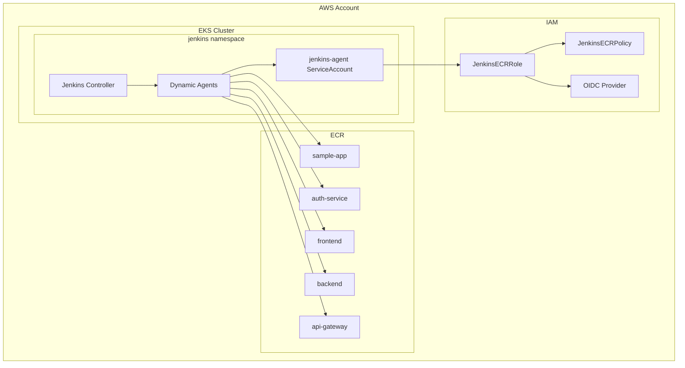

# Jenkins CloudFormation Templates

This directory contains CloudFormation templates for setting up Jenkins infrastructure on AWS EKS with ECR integration.

## 📁 Directory Structure

```
cloudformation-templates/
├── README.md                    # This file
├── irsa/                       # IRSA setup for Jenkins ECR access
│   ├── jenkins-irsa.yaml      # CloudFormation template
│   ├── deploy-irsa.sh          # Deployment script
│   └── README.md               # IRSA documentation
└── ecr/                        # ECR repositories for Jenkins
    ├── jenkins-ecr-repositories.yaml  # CloudFormation template
    ├── deploy-ecr.sh           # Deployment script
    └── README.md               # ECR documentation
```

## 🚀 Quick Start

### **1. Deploy ECR Repositories**
```bash
cd ecr/
chmod +x deploy-ecr.sh
./deploy-ecr.sh
```

### **2. Deploy IRSA for ECR Access**
```bash
cd ../irsa/
chmod +x deploy-irsa.sh
./deploy-irsa.sh
```

### **3. Deploy Jenkins with JCasC**
```bash
cd ../../jenkins-casc/
chmod +x deploy-jenkins-from-scratch.sh
./deploy-jenkins-from-scratch.sh
```

## 🏗️ Architecture Overview



## 📋 What Gets Created

### **ECR Infrastructure**
- ✅ **5 ECR Repositories** with lifecycle policies
- ✅ **Image scanning** enabled for security
- ✅ **Automatic cleanup** of old images
- ✅ **Proper tagging** for organization

### **IRSA Infrastructure**
- ✅ **IAM Role** for service account assumption
- ✅ **IAM Policy** with ECR permissions
- ✅ **Trust relationship** with EKS OIDC provider
- ✅ **Kubernetes service account** with annotations

### **Integration Benefits**
- ✅ **No hardcoded credentials** in Jenkins
- ✅ **Automatic ECR authentication** via IRSA
- ✅ **Secure and scalable** architecture
- ✅ **Infrastructure as Code** approach

## 🔧 Customization

### **ECR Configuration**
Edit `ecr/deploy-ecr.sh`:
```bash
PROJECT_NAME="your-project"
ENVIRONMENT="prod"
REPOSITORY_NAMES="app1,app2,app3"
LIFECYCLE_POLICY_DAYS="7"  # Shorter retention for prod
```

### **IRSA Configuration**
Edit `irsa/deploy-irsa.sh`:
```bash
CLUSTER_NAME="your-eks-cluster"
SERVICE_ACCOUNT_NAME="your-jenkins-agent"
ROLE_NAME="YourJenkinsECRRole"
```

## 🔄 Deployment Order

**Important**: Deploy in this order for proper dependencies:

1. **ECR Repositories** - Create container registries first
2. **IRSA Setup** - Create IAM roles and service accounts
3. **Jenkins Deployment** - Deploy Jenkins with ECR access

## 🧪 Testing the Setup

### **1. Test ECR Access**
```bash
# List repositories
aws ecr describe-repositories --region us-east-1

# Test from Jenkins agent pod
kubectl run test-ecr \
    --image=amazon/aws-cli:latest \
    --serviceaccount=jenkins-agent \
    --namespace=jenkins \
    --rm -it --restart=Never \
    -- aws ecr describe-repositories --region us-east-1
```

### **2. Test Jenkins Pipeline**
Use the sample pipeline from `ecr/sample-pipeline.groovy` to test end-to-end functionality.

## 📊 Monitoring and Maintenance

### **ECR Repository Monitoring**
```bash
# Check repository sizes
aws ecr describe-repositories \
    --query 'repositories[*].[repositoryName,repositoryUri]' \
    --output table

# Monitor image counts
for repo in sample-app auth-service frontend backend api-gateway; do
    echo "Repository: jenkins-demo/$repo"
    aws ecr describe-images \
        --repository-name jenkins-demo/$repo \
        --query 'length(imageDetails)' \
        --output text
done
```

### **IRSA Health Check**
```bash
# Verify service account annotation
kubectl describe serviceaccount jenkins-agent -n jenkins

# Test role assumption
kubectl run test-sts \
    --image=amazon/aws-cli:latest \
    --serviceaccount=jenkins-agent \
    --namespace=jenkins \
    --rm -it --restart=Never \
    -- aws sts get-caller-identity
```

## 🔄 Updates and Maintenance

### **Update ECR Lifecycle Policies**
```bash
cd ecr/
# Edit LIFECYCLE_POLICY_DAYS in deploy-ecr.sh
./deploy-ecr.sh  # Redeploy with new settings
```

### **Update IRSA Permissions**
```bash
cd irsa/
# Edit jenkins-irsa.yaml to add/remove permissions
./deploy-irsa.sh  # Redeploy with new permissions
```

### **Add New ECR Repository**
1. Edit `ecr/jenkins-ecr-repositories.yaml`
2. Add new repository resource
3. Update outputs section
4. Redeploy: `cd ecr && ./deploy-ecr.sh`

## 🗑️ Complete Cleanup

To remove all infrastructure:

```bash
# 1. Delete Jenkins (if deployed)
helm uninstall jenkins -n jenkins

# 2. Delete IRSA resources
cd irsa/
kubectl delete -f service-account.yaml
aws cloudformation delete-stack --stack-name jenkins-irsa-stack --region us-east-1

# 3. Delete ECR repositories
cd ../ecr/
aws cloudformation delete-stack --stack-name jenkins-ecr-repositories --region us-east-1
```

## 💰 Cost Considerations

### **ECR Costs**
- ✅ **Storage**: ~$0.10/GB/month
- ✅ **Data Transfer**: Free within same region
- ✅ **Lifecycle policies** help control costs

### **IAM Costs**
- ✅ **IRSA**: No additional cost
- ✅ **Lambda function**: Minimal cost (only runs during stack operations)

### **Optimization Tips**
- ✅ Use multi-stage Docker builds
- ✅ Implement aggressive lifecycle policies for dev environments
- ✅ Monitor repository sizes regularly

## 🔍 Troubleshooting

### **Common Issues**

| Issue | Solution |
|-------|----------|
| ECR push fails | Check IRSA setup and service account annotation |
| Repository not found | Verify repository name and region |
| Permission denied | Check IAM policy and trust relationship |
| Stack creation fails | Verify EKS cluster exists and OIDC provider is configured |

### **Debug Commands**
```bash
# Check CloudFormation stack status
aws cloudformation describe-stacks --stack-name jenkins-irsa-stack
aws cloudformation describe-stacks --stack-name jenkins-ecr-repositories

# Check EKS cluster OIDC
aws eks describe-cluster --name student-eks-cluster --query 'cluster.identity.oidc'

# Test ECR authentication
aws ecr get-login-password --region us-east-1 | docker login --username AWS --password-stdin <registry-url>
```

## 📚 References

- [AWS CloudFormation Documentation](https://docs.aws.amazon.com/cloudformation/)
- [Amazon ECR User Guide](https://docs.aws.amazon.com/ecr/)
- [IAM Roles for Service Accounts](https://docs.aws.amazon.com/eks/latest/userguide/iam-roles-for-service-accounts.html)
- [Jenkins on Kubernetes](https://plugins.jenkins.io/kubernetes/)

---

**Ready to deploy?** Follow the Quick Start guide above to get your Jenkins ECR infrastructure running in minutes! 🚀
