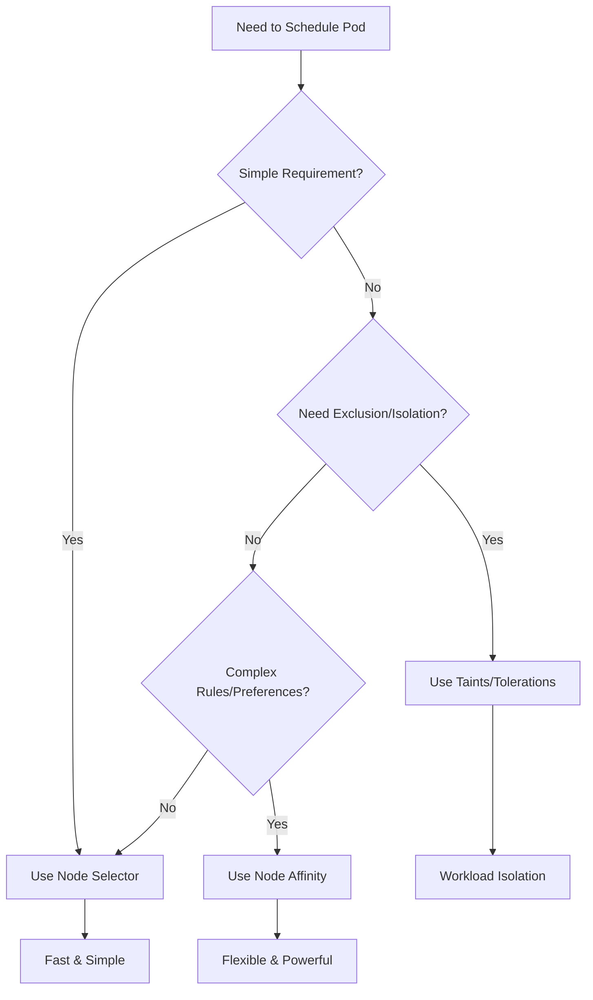

# Kubernetes Node Scheduling: Node Affinity, Node Selector & Taints/Tolerations

## Table of Contents
1. [Overview](#overview)
2. [Node Selector](#node-selector)
3. [Node Affinity](#node-affinity)
4. [Taints and Tolerations](#taints-and-tolerations)
5. [Comparison Matrix](#comparison-matrix)
6. [Real-World Examples](#real-world-examples)
7. [Best Practices](#best-practices)

---

## Overview

Kubernetes provides three main mechanisms to control **where pods are scheduled**:

| Mechanism | Purpose | Complexity | Use Case |
|-----------|---------|------------|----------|
| **Node Selector** | Simple node selection | Low | Basic requirements |
| **Node Affinity** | Advanced node selection | Medium | Complex scheduling rules |
| **Taints/Tolerations** | Node exclusion/isolation | Medium | Workload isolation |

---

## Node Selector

### **What is Node Selector?**
- **Simplest** way to constrain pods to nodes
- Uses **key-value labels** on nodes
- **Hard requirement** - pod won't schedule if no matching node

### **How it Works**
```yaml
# 1. Label a node
kubectl label nodes worker-1 disktype=ssd

# 2. Use nodeSelector in pod
apiVersion: v1
kind: Pod
metadata:
  name: nginx
spec:
  containers:
  - name: nginx
    image: nginx
  nodeSelector:
    disktype: ssd  # Only schedule on nodes with this label
```

### **Characteristics**
- ✅ **Simple** to understand and implement
- ✅ **Fast** scheduling decisions
- ❌ **Limited flexibility** - only exact matches
- ❌ **No fallback options** if no nodes match

### **Use Cases**
- Schedule pods on **specific instance types**
- Ensure workloads run on **SSD-backed nodes**
- Separate **development** vs **production** workloads

---

## Node Affinity

### **What is Node Affinity?**
- **Advanced** node selection with flexible rules
- Supports **required** and **preferred** scheduling
- Uses **expressions** instead of exact matches

### **Types of Node Affinity**

#### **1. Required During Scheduling (Hard)**
```yaml
apiVersion: v1
kind: Pod
metadata:
  name: nginx
spec:
  affinity:
    nodeAffinity:
      requiredDuringSchedulingIgnoredDuringExecution:
        nodeSelectorTerms:
        - matchExpressions:
          - key: kubernetes.io/arch
            operator: In
            values: ["amd64", "arm64"]
          - key: node.kubernetes.io/instance-type
            operator: NotIn
            values: ["t2.micro"]
  containers:
  - name: nginx
    image: nginx
```

#### **2. Preferred During Scheduling (Soft)**
```yaml
apiVersion: v1
kind: Pod
metadata:
  name: nginx
spec:
  affinity:
    nodeAffinity:
      preferredDuringSchedulingIgnoredDuringExecution:
      - weight: 100
        preference:
          matchExpressions:
          - key: disktype
            operator: In
            values: ["ssd"]
      - weight: 50
        preference:
          matchExpressions:
          - key: kubernetes.io/arch
            operator: In
            values: ["amd64"]
  containers:
  - name: nginx
    image: nginx
```

### **Operators Available**
| Operator | Description | Example |
|----------|-------------|---------|
| `In` | Value in list | `["amd64", "arm64"]` |
| `NotIn` | Value not in list | `["t2.micro"]` |
| `Exists` | Key exists | `disktype` exists |
| `DoesNotExist` | Key doesn't exist | `gpu` doesn't exist |
| `Gt` | Greater than | `generation > 5` |
| `Lt` | Less than | `generation < 3` |

### **Characteristics**
- ✅ **Flexible** expressions and operators
- ✅ **Soft preferences** with weights
- ✅ **Multiple conditions** in one rule
- ❌ **More complex** to write and debug
- ❌ **Slower** scheduling decisions

---

## Taints and Tolerations

### **What are Taints and Tolerations?**
- **Taints**: Applied to **nodes** to repel pods
- **Tolerations**: Applied to **pods** to tolerate taints
- **Opposite** of affinity - focuses on **exclusion**

### **How Taints Work**
```bash
# Add taint to node
kubectl taint nodes worker-1 key=value:NoSchedule

# Remove taint
kubectl taint nodes worker-1 key=value:NoSchedule-
```

### **Taint Effects**
| Effect | Description | Behavior |
|--------|-------------|----------|
| `NoSchedule` | Don't schedule new pods | Existing pods stay |
| `PreferNoSchedule` | Avoid scheduling (soft) | Try other nodes first |
| `NoExecute` | Evict existing pods | Remove running pods |

### **Toleration Examples**

#### **1. Exact Match Toleration**
```yaml
apiVersion: v1
kind: Pod
metadata:
  name: nginx
spec:
  tolerations:
  - key: "key"
    operator: "Equal"
    value: "value"
    effect: "NoSchedule"
  containers:
  - name: nginx
    image: nginx
```

#### **2. Exists Toleration (Any Value)**
```yaml
apiVersion: v1
kind: Pod
metadata:
  name: nginx
spec:
  tolerations:
  - key: "gpu"
    operator: "Exists"
    effect: "NoSchedule"
  containers:
  - name: nginx
    image: nginx
```

#### **3. Tolerate All Taints**
```yaml
apiVersion: v1
kind: Pod
metadata:
  name: nginx
spec:
  tolerations:
  - operator: "Exists"  # Tolerates all taints
  containers:
  - name: nginx
    image: nginx
```

### **Characteristics**
- ✅ **Workload isolation** and dedicated nodes
- ✅ **Automatic eviction** with NoExecute
- ✅ **System pod protection** on master nodes
- ❌ **Doesn't guarantee** pod placement
- ❌ **Requires both** taint and toleration setup

---

## Comparison Matrix

| Feature | Node Selector | Node Affinity | Taints/Tolerations |
|---------|---------------|---------------|-------------------|
| **Complexity** | Low | Medium | Medium |
| **Flexibility** | Low | High | Medium |
| **Performance** | Fast | Slower | Fast |
| **Fallback Options** | None | Yes (preferred) | None |
| **Multiple Conditions** | Limited | Yes | Yes |
| **Operators** | Equality only | 6 operators | Equality/Exists |
| **Weights/Priority** | No | Yes | No |
| **Node Exclusion** | No | Limited | Yes |
| **Pod Eviction** | No | No | Yes (NoExecute) |
| **Use Case** | Simple selection | Complex rules | Isolation/Exclusion |

---

## Real-World Examples

### **Example 1: GPU Workloads**

#### **Using Node Selector**
```yaml
# Simple: Schedule on GPU nodes
nodeSelector:
  accelerator: nvidia-tesla-k80
```

#### **Using Node Affinity**
```yaml
# Advanced: Prefer newer GPUs, require GPU
affinity:
  nodeAffinity:
    requiredDuringSchedulingIgnoredDuringExecution:
      nodeSelectorTerms:
      - matchExpressions:
        - key: accelerator
          operator: Exists
    preferredDuringSchedulingIgnoredDuringExecution:
    - weight: 100
      preference:
        matchExpressions:
        - key: accelerator
          operator: In
          values: ["nvidia-tesla-v100", "nvidia-tesla-t4"]
```

#### **Using Taints/Tolerations**
```yaml
# Isolation: Dedicated GPU nodes
# Taint: kubectl taint nodes gpu-node-1 gpu=true:NoSchedule

tolerations:
- key: "gpu"
  operator: "Equal"
  value: "true"
  effect: "NoSchedule"
```

### **Example 2: EKS Auto Mode (Our Experience)**

#### **System Nodes with Taints**
```yaml
# System NodePool (from our cluster)
taints:
- key: "CriticalAddonsOnly"
  effect: "NoSchedule"
```

#### **Custom NodePool with Taints**
```yaml
# Custom NodePool (what we created)
taints:
- key: "custom-workload"
  value: "true"
  effect: "NoSchedule"
```

#### **Pod Tolerating Custom Taint**
```yaml
# Our test pod
tolerations:
- key: "custom-workload"
  value: "true"
  effect: "NoSchedule"
nodeSelector:
  nodepool-type: "custom"
```

### **Example 3: Multi-Environment Setup**

#### **Node Labels**
```bash
kubectl label nodes prod-1 environment=production
kubectl label nodes prod-2 environment=production
kubectl label nodes dev-1 environment=development
```

#### **Production Workload**
```yaml
# Using Node Affinity for production
affinity:
  nodeAffinity:
    requiredDuringSchedulingIgnoredDuringExecution:
      nodeSelectorTerms:
      - matchExpressions:
        - key: environment
          operator: In
          values: ["production"]
        - key: node.kubernetes.io/instance-type
          operator: NotIn
          values: ["t2.micro", "t3.micro"]  # Exclude small instances
```

#### **Development with Taints**
```bash
# Taint dev nodes to prevent prod workloads
kubectl taint nodes dev-1 environment=development:NoSchedule
```

---

## Best Practices

### **1. When to Use Each Method**

#### **Use Node Selector When:**
- ✅ Simple, single-condition requirements
- ✅ Performance is critical
- ✅ Team has limited Kubernetes experience
- ✅ Static, unchanging requirements

#### **Use Node Affinity When:**
- ✅ Complex scheduling logic needed
- ✅ Multiple conditions or preferences
- ✅ Fallback options required
- ✅ Weight-based prioritization needed

#### **Use Taints/Tolerations When:**
- ✅ Need to isolate workloads
- ✅ Dedicated nodes for specific purposes
- ✅ Want to prevent certain pods from scheduling
- ✅ Need automatic pod eviction

### **2. Combining Methods**

#### **Example: High-Security Workload**
```yaml
apiVersion: v1
kind: Pod
metadata:
  name: secure-app
spec:
  # Node Affinity: Prefer dedicated security nodes
  affinity:
    nodeAffinity:
      preferredDuringSchedulingIgnoredDuringExecution:
      - weight: 100
        preference:
          matchExpressions:
          - key: security-level
            operator: In
            values: ["high"]
  
  # Tolerations: Can run on isolated nodes
  tolerations:
  - key: "dedicated"
    operator: "Equal"
    value: "security"
    effect: "NoSchedule"
  
  # Node Selector: Must be in secure zone
  nodeSelector:
    zone: "secure"
  
  containers:
  - name: app
    image: secure-app:latest
```

### **3. Performance Considerations**

#### **Scheduling Speed (Fastest to Slowest)**
1. **Node Selector** - Simple label matching
2. **Taints/Tolerations** - Basic exclusion logic
3. **Node Affinity** - Complex expression evaluation

#### **Optimization Tips**
- Use **Node Selector** for simple cases
- Combine **required** and **preferred** affinity wisely
- Limit number of **preferred** rules
- Use **specific labels** to reduce search space

### **4. Common Patterns**

#### **Pattern 1: Workload Isolation**
```yaml
# Taint nodes for specific workloads
kubectl taint nodes ml-node-1 workload=machine-learning:NoSchedule
kubectl taint nodes db-node-1 workload=database:NoSchedule

# Pods tolerate their specific taints
tolerations:
- key: "workload"
  value: "machine-learning"
  effect: "NoSchedule"
```

#### **Pattern 2: Resource-Based Scheduling**
```yaml
# Use affinity for resource requirements
affinity:
  nodeAffinity:
    requiredDuringSchedulingIgnoredDuringExecution:
      nodeSelectorTerms:
      - matchExpressions:
        - key: node.kubernetes.io/instance-type
          operator: In
          values: ["c5.4xlarge", "c5.9xlarge"]  # CPU-intensive
        - key: kubernetes.io/arch
          operator: In
          values: ["amd64"]
```

#### **Pattern 3: Geographic Distribution**
```yaml
# Spread across zones with preferences
affinity:
  nodeAffinity:
    preferredDuringSchedulingIgnoredDuringExecution:
    - weight: 100
      preference:
        matchExpressions:
        - key: topology.kubernetes.io/zone
          operator: In
          values: ["us-west-2a"]
    - weight: 50
      preference:
        matchExpressions:
        - key: topology.kubernetes.io/zone
          operator: In
          values: ["us-west-2b"]
```

---

## Summary

### **Quick Decision Guide**



### **Key Takeaways**

1. **Start Simple**: Use Node Selector for basic needs
2. **Isolate Workloads**: Use Taints/Tolerations for dedicated nodes
3. **Complex Logic**: Use Node Affinity for advanced scheduling
4. **Combine Methods**: Mix approaches for comprehensive control
5. **Performance Matters**: Consider scheduling overhead
6. **Test Thoroughly**: Verify scheduling behavior in staging

### **Common Mistakes to Avoid**

- ❌ Over-engineering simple requirements
- ❌ Forgetting to add tolerations for tainted nodes
- ❌ Using too many preferred affinity rules
- ❌ Not testing edge cases (no matching nodes)
- ❌ Mixing conflicting scheduling constraints

---

*This presentation covers the three main Kubernetes node scheduling mechanisms with practical examples from real-world scenarios, including our EKS Auto Mode experience with NodePools and custom taints.*
